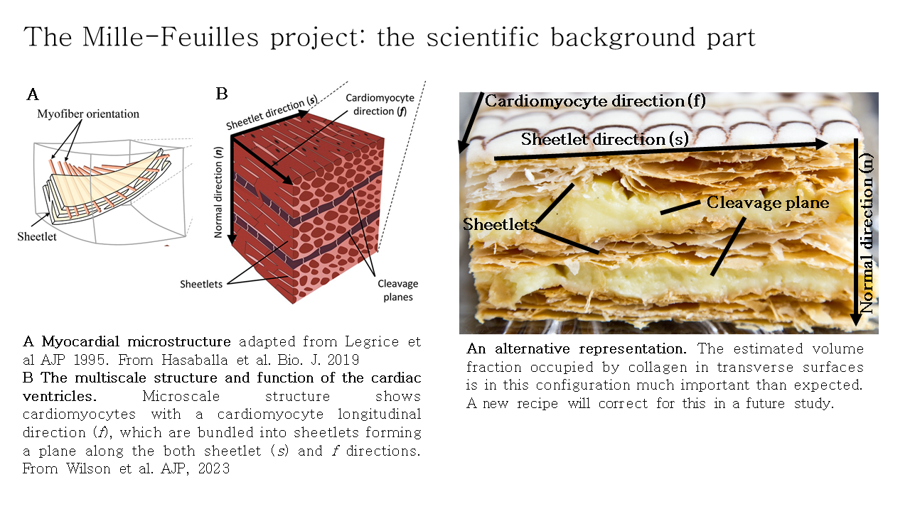

# Mille-Feuilles

L'écosysteme Mille-Feuilles est une suite logicielle avec une forte emphase sur la microstructure cardiaque.

# Les projets

- Milleu-Feuilles calculateur (en construction)

- Mille-Feuilles predicteur (en construction)

- Le service Mille-Feuille, une déclinaison privée centrée des projets internes de l'IHU

# Les fondements scientifiques du projet

